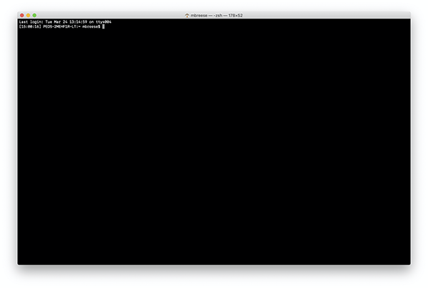
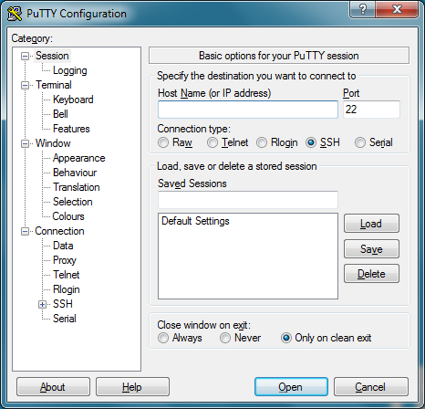

<h1>The terminal</h1>

The terminal is the common interface for all command-line access. Most often, the terminal will be a GUI program that just has a big, blank text area with a command-prompt. A GUI isn't required, however... terminals can be seen when a computer starts in text-mode, or even accessed through a web-site.

## Opening a terminal

### Mac

To open a terminal session on a Mac, you will need to run the `Terminal` application. It is located in `/Applications/Utilities/Terminal.app`

!!! note
    One easy way to do this is to use Spotlight Search (`⌘-space`) and type `Terminal` to quickly start the program.

#### Disconnecting

When you are done with your session and want to cleanly exit, run the `exit` command. This will close this terminal session. The window may still appear, but it can be safely closed. 

Alternatively, you could also quit the program entirely with `⌘-q`. This will only work if there aren't other programs still running.

### Windows

Windows, doesn't have a good default terminal available. Because of this, you will need to skip ahead to the [Remote server (SSH)](#remote-server-ssh) section.

!!! note
    There are terminal programs for Windows, including Cygwin and the WSL; however setting these up is outside of the scope of this tutorial. When getting started, it is easier to SSH to a server and get started there.

# Remote server (via SSH)

Connecting to a remote server has many advantages over using only your local computer.
First, the amount of processing power and storage on remote server can be significantly greater
than that of a laptop. Second, when you are using a shared server, it is easier to share data and programs with others. 

The main network protocol that is used to connect to a remote server is called SSH. This stands for "Secure Shell". This program
works by creating an encrypted tunnel between your computer and the remote server. When you are using SSH, you are connecting to the
remote server in as secure a manner as possible.

!!! note
    When you connect to a remote server, your local computer (laptop / desktop / phone), is also known as the "client". So, if you see the word "client", that almost always refers to the local computer you are physically using. The "server" is almost always the remote computer you are connected to.

## Connecting to the remote server

### Mac / Linux

When using a Mac or Linux computer, SSH is built into the operating system. However, it is not a graphical (GUI) program, but rather a command-line program. In order to start SSH, you need to first open a terminal ([see above](#opening-a-terminal)). Next, the command you need to enter is:

    $ ssh username@hostname

Where the `username` is your username on the remote server and `hostname` is the hostname or ip-address of the server. For example, 
to connect to the remote server `example.com` with the username of `billy`, you'd type:

    $ ssh billy@example.com

If this looks a bit like an email address, that's because they both refer to similar concepts — a user account on a specific server! And if your username on the remote server is the same as your username on your desktop/laptop, you don't even need to tell SSH the password.

The SSH program is quite powerful, and can be used to do many other things, such as creating tunnels to remote servers, but for now, we'll just concentrate on the primary purpose of connecting to remote servers.

### Windows
    
Using SSH on a Windows computer requires a GUI client[^1].

#### Putty

One SSH client that I've used in the past is: [PuTTY](https://www.chiark.greenend.org.uk/~sgtatham/putty/). This is one of the most commonly used Windows SSH clients, and will support any of the commands that we will discuss in this tutorial.

https://www.chiark.greenend.org.uk/~sgtatham/putty/

#### MobaXterm

Another recommended option is MobaXterm, which is a more full-featured program that includes support for tabbed connections and X11 graphics.

https://mobaxterm.mobatek.net/

[^1]: Again, I'm intentionally ignoring things like WSL and Cygwin.

### Security

Regardless of the method you use to connect to a remote server, when you connect the first time to a server, the SSH software will likely ask you to confirm the server's identity. This is a normal prompt the first time you connect to a server. You will be presented with a signature (SHA256, MD5, etc) of the key that will look something like this: `ECDSA key fingerprint is SHA256:zC45ZzJRNzPYcjdS7dTHULo16Zl71g7sgm2fwC0ShGA`. These signatures are a security feature used to confirm that you're connecting to the server you expect and that no one else is listening into your connection. But, the first time you connect to a server, you may not know this information. If the remote server's administrator has given you these signatures, then you can compare that values you have to the ones you expect. But, if you don't have the signatures beforehand, you'll probably have to trust that the server is who they say they are.

The entire point of SSH is security (SSH stands for "secure shell"), so if you have any questions, you should ask the server's admin.

## Disconnecting

When you are done with your session and want to cleanly exit, again you can run the `exit` command. This will close the connection to the remote server.

This will only work if there aren't background jobs running on the server. If you get a message about "suspended jobs", check the section on [process control](common.md#process-control).

## Authentication

In general, most servers allow you to authenticate with a username/password combination. However, it can get tiring typing passwords all the time — also, using passwords isn't as secure as possible. Because of this, some servers require the use of public/private keys. Public key encryption is out of the scope for this tutorial, but if you're interested in learning more, you can check out the Wikipedia entry on [Public key cryptography](https://en.wikipedia.org/wiki/Public-key_cryptography). The basic concept though is that you have two keys: the public one and the private one. The public one is what you can hand out to other people... in this case the other server. The private key, you keep secret. It should always stay on your computer and never be copied to the server. The server also has a set of public/private keys. When you talk to the server, you use *your* private key and *its* public key. When the server sends information to you, it uses *its* private key and *your* public key.

### Mac / Linux

For the purposes of SSH, if you need to generate a public key to use to connect to a server, there is a program called `ssh-keygen` that will handle it for you. When you run this program, it will generate a fresh public/private key pair for you. You can set a password on the key, which will let you access the key. It is **highly** recommended that you set a password for the key. By default, this key will be named `$HOME/.ssh/id_rsa` or `$HOME/.ssh/id_dsa`, depending on the configured algorithm. Don't worry, the server will likley be able to handle either format.

!!! note
    Wait... but I thought that using a password wasn't as secure as public keys?!? If that's the case, then why another password?

    Originally, the password was send to the remote server to authenticate you. With public/private keys, it is your key that authenticates you. The password protects your private key on your computer... the password and private key never get sent anywhere. The key is what authenticates you with the server. The password for the key is used to "unlock" the key so that it can be used to authenticate you with the server.

For more information, see this help document from Github: https://help.github.com/en/github/authenticating-to-github/generating-a-new-ssh-key-and-adding-it-to-the-ssh-agent

### Windows

For Windows, the program PuTTYgen can also be used to generate keys. For more information see these links:

* https://www.ssh.com/ssh/putty/windows/puttygen/
* https://www.puttygen.com/

## SSH configuration

As your SSH settings get more complex, you may want to look at writing an ssh config file. This file contains all of the settings that you'd normally use (like hostname, username, and if you use different keys for different servers). The settings can be set for a per-server or global basis. On Mac/Linux, this file is located in `$HOME/.ssh/config`. On Windows, the values can all be set in PuTTY.

For more information see these sites:

* https://www.digitalocean.com/community/tutorials/how-to-configure-custom-connection-options-for-your-ssh-client
* https://nerderati.com/2011/03/17/simplify-your-life-with-an-ssh-config-file
* (Windows) https://www.ssh.com/ssh/putty/windows/

## SSH alternatives

There are a few alternatives for connecting to a remote server. One relatively common alternative is [mosh](https://mosh.org/), which stands for "Mobile shell". This program still uses SSH for the initial authentication steps, but after that, the programs are very different. Mosh is designed to be used on mobile phone networks where the connections are not expected to be robust. To account for this, mosh is designed to work around issues like dropped connections and changed IP addresses. Not all servers support mosh, but if you routinely connect to a remote server using a mobile phone network (or even spotty WiFi), it can be a great tool.
