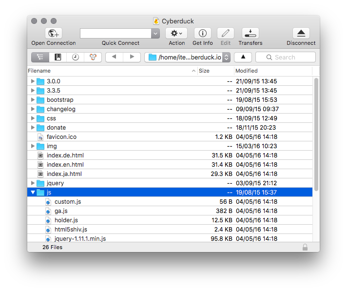
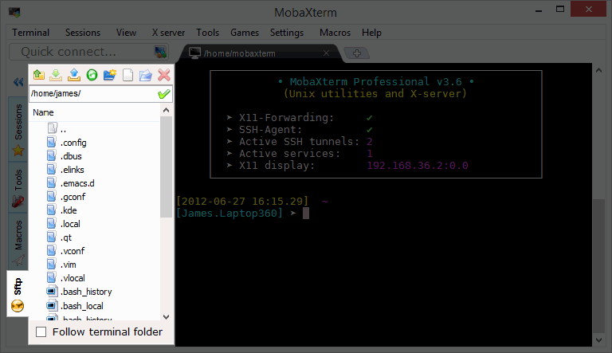
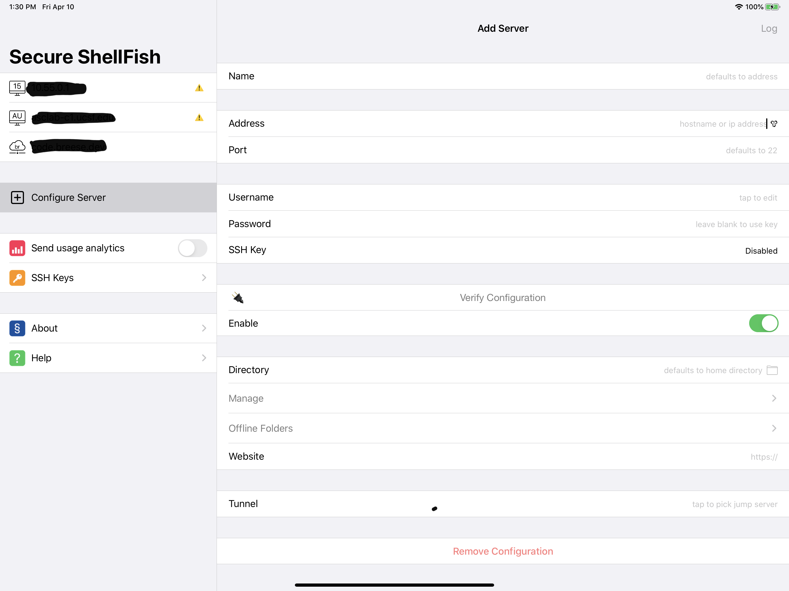

# Transferring data

Getting data onto a remote system and getting results back to your local computer can sometimes be a bit of a challenge. Unsurprisingly, there are a few options available to you, including some good GUI options.

## Command-line programs

For the below programs, `scp` and `sftp` should be already installed. If you are using Windows, there are command-line versions of these programs available as well, such as those supplied with PuTTY (although, they may have slightly different names). `rsync` is also installed by default on Macs, but you may need to install it separately if you are using a Linux client.

### scp

`scp` can be used to copy files from one location to another. The locations can be local or remote. You can even use scp to transfer files from one server to a different server.

    scp localfile username@server:dest_dir/filename

    scp username@server:dest_dir/filename local_dir/local_file

### sftp

`sftp` is like `scp`, but interactive. You can connect to the remote SFTP server, list files, get files, put files, etc... This is a command-line program, but it is one way to interactively browse around the files on a remote server.

    sftp username@server

Once connected, you can `ls` and `cd` to navigate around. When you want to download a file, run `get remote_filename`.  When you want to upload a file, run `put local_filename` When you are done and want to disconnect, run `exit`.

### rsync

A final option is `rsync`. Rsync works by finding the files changed between two locations (local and remote), and sending only the changed data between the two. This is particularly helpful when you are transfering a lot of data or trying to keep two computers in sync with each other. This can also be used to copy files on the same server or between servers.

    rsync localfile username@server:dest_dir/filename

    rsync username@server:dest_dir/filename local_dir/local_file

    rsync localfile1 localfile2

    rsync username@server1:dir/filename  username@server2:dest_dir/filename

If this looks the same as the `scp` instructions, that's because it is! However, you almost always want to run `rsync` with a few options.

    rsync -avz --progress localfile username@server:dest_dir/filename

    rsync -avz --progress username@server:dest_dir/filename local_dir/local_file

    rsync -av --progress localfile1 localfile2

    rsync -avz --progress username@server1:dir/filename  username@server2:dest_dir/filename

Here, we added the `-a`, `-v`, `-z` and `--progress` options. `-a` stands for "archive", which sync directories (recursively), permissions, dates, owner infromation, etc. Not all of these will translate to your local computer, but it is very useful when transfering files on the same server or between servers with the same user/group configurations. `-v` stands for "verbose". This will print out a bit more information about the transfer on the terminal for you to see how the transfer is progressing. `-z` enables zlib compression while you are transferring. This doesn't help if you are copying files on the same server, but can save a lot of bandwidth when copying to/from a remote server. Finally, the `--progress` option tells rsync to print out a progress meter for the current transfer. It isn't necessary, but it is a nice way to monitor the status of the current file's transmission.

## GUI

### Cyberduck (macOS, Windows)

If you prefer a GUI program, one option is the [Cyberduck](https://cyberduck.io/) program. It is available for Windows and Mac, and can make it easy to upload and download data from a remote server. It is also available for free, which is another bonus (but there is a donation prompt that appears until you register the program for $10).

For more information see here: https://cyberduck.io/

### MobaXterm (Windows)

If you're using Windows, the MobaXterm program can be used to provide both SSH access to remote servers as well as SFTP access to transfer files back and forth.

### Secure ShellFish (iOS)

There is also an option for data transfer when using an iPad or iPhone! You can use the program Secure ShellFish to link a remote server (using SSH/SFTP) to the iOS Files.app.

## Downloading from websites

	curl -L asclab.ucsf.edu/test.csv
